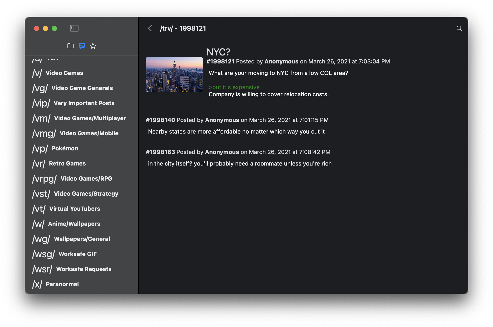

# Debiru

A native macOS reader for your favorite neighborhood imageboard.

## About

This project is intended to build a simple yet functional viewer for browsing the typical imageboards out there on the interwebs. It's not intended to be a replacement for what your browser can already do, but instead the aim is to make the experience feel more native for the macOS platform.

As an aside, this is also an experiement to see how much SwiftUI has progressed since its inception. An app like this will most likely make use of a large surface area of SwiftUI's capabilities, and for me, it's a good benchmark to see what's missing and what's easier than using AppKit directly.

## Developing

You'll need macOS 11.x and Xcode 12.4. Simpy open the Xcode project, and build and run the app. At this time, all dependencies are configured using Swift Package Manager, so you should not need any external tools.

## Contributing

All contributions are welcome! Feel free to open a pull request if there is something you'd like to pitch in for the project. 
